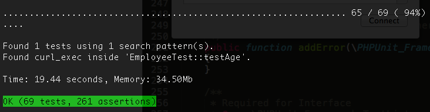

# Trace test listener
Searches the call trace when running your unit tests. Useful for identifying dependencies that should be mocked.

Scenarios for using this may include finding out which tests are:

* Hitting a real database, web service, etc.
* Using deprecated features.
* Using tightly coupled code.



## Installation

TraceTestListener is installable via [Composer](http://getcomposer.org) and should be added as a `require-dev` dependency:

    php composer.phar require --dev cabdesigns/trace-test-listener dev-master

XDebug **must** be installed for this listener to work.

## Configuration

Configure the search terms you want to look for inside the call trace, using an array argument.

You can also optionally set the directory to write the trace files to. This will default to the `traces` folder.

```xml
<phpunit bootstrap="vendor/autoload.php">

    <!-- ... other suite configuration here ... -->

    <listeners>
        <listener class="CABDesigns\PHPUnit\Listener\TraceTestListener">
            <arguments>
                <array>
                    <element key="0">
			          	<string>curl_exec</string>
			        </element>
                </array>
                <string>traces</string>
            </arguments>
        </listener>
    </listeners>
</phpunit>
```
